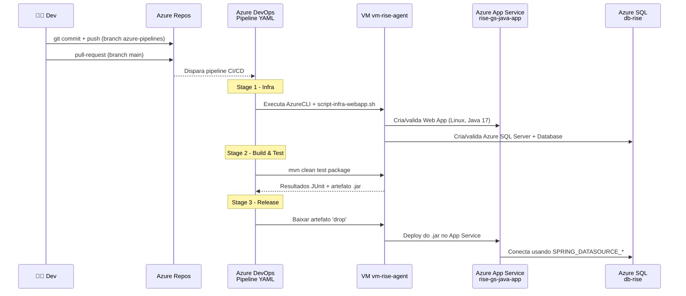

# 🌐 GS Rise – API e Aplicação Web (Spring Boot)

Projeto desenvolvido para a **Global Solution da FIAP – RISE**, utilizando **Java Spring Boot**, **SQL Server**, **Azure**, **Swagger**, **RabbitMQ**, **Thymeleaf**, **Flyway** e **CI/CD com Azure DevOps**.

Este repositório contém toda a solução da API + aplicação web, incluindo documentação, camada visual, migrações Flyway e testes automatizados.

---

## 📌 Integrantes da Equipe
| Nome | RM |
|------|------|
| **Raphaela Oliveira Tatto** | 554983 |
| **Tiago Ribeiro Capela** | 558021 |

---

## 📼 Links da Entrega
- **Vídeo de apresentação:** https://youtu.be/4if-_zztZh4  
- **Link da aplicação (Azure App Service):** https://rise-gs-java-app.azurewebsites.net/login
- **Video Pitch** _insira aqui_

---

## 🏗️ Arquitetura da Solução

A solução segue uma arquitetura limpa e desacoplada:  

```
📦 gs_rise
 ┣ 📂 src/main/java/br/com/fiap/gs_rise
 │   ┣ 📂 controller     → Controllers REST e Web
 │   ┣ 📂 service        → Regras de negócio (Services)
 │   ┣ 📂 repository     → Interfaces JPA
 │   ┣ 📂 model          → Entidades do banco
 │   ┣ 📂 config         → Configurações (Security, Swagger, RabbitMQ)
 │   ┗ 📂 dto            → DTOs para requisições e respostas
 ┣ 📂 src/main/resources
 │   ┣ 📂 db/migration   → Scripts SQL do Flyway
 │   ┣ 📂 static/css     → Estilos da aplicação Web
 │   ┗ 📂 templates      → Páginas Thymeleaf
 ┗ 📄 pom.xml            → Dependências Maven
```

Principais componentes:
- **Spring Web**
- **Thymeleaf**
- **JPA + SQL Server**
- **Flyway**
- **Swagger/OpenAPI**
- **RabbitMQ**
- **Azure App Service**
- **Azure DevOps**

---

## ⚙️ Requisitos
- Java 17+
- Maven 3.8+
- SQL Server
- RabbitMQ (opcional)

---

## 🚀 Como Executar o Projeto

### 1️⃣ Clonar o projeto
```bash
git clone <url-do-repositorio>
cd gs_rise
```
### Necessaario ter o Docker instalado e rodar esse comando para o RabbitMQ funcionar
```bash
docker run -d \
  --name rabbitmq \
  -p 5672:5672 \
  -p 15672:15672 \
  rabbitmq:3-management
  ```
### 2️⃣ Configurar o banco de dados (`application.properties`)
```properties
spring.datasource.url=jdbc:sqlserver://<server>.database.windows.net:1433;database=<nome-db>
spring.datasource.username=<usuario>
spring.datasource.password=<senha>
```

### 3️⃣ Instalar dependências
```bash
./mvnw dependency:resolve
```

### 4️⃣ Rodar a aplicação
```bash
./mvnw spring-boot:run
```

---

## 🧪 Testes Automatizados 

### Como rodar:
```bash
./mvnw test
```

Exemplo de teste:
```java
@SpringBootTest
@AutoConfigureMockMvc
class UsuarioControllerTest {

    @Autowired
    private MockMvc mockMvc;

    @Test
    void deveListarUsuarios() throws Exception {
        mockMvc.perform(get("/api/v1/usuarios"))
                .andExpect(status().isOk());
    }
}
```

---

## 📤 Deploy no Azure – Resumo da Pipeline
1. **Build:** compila, testa e gera o .jar  
2. **Infraestrutura:** cria RG, App Service, SQL Server, etc.  
3. **Deploy:** publica o .jar no Azure App Service  

---
### Fluxo CI/CD — Visão de Pipeline



---

## 🧾 Swagger
```
http://localhost:8080/swagger-ui.html
```

---
